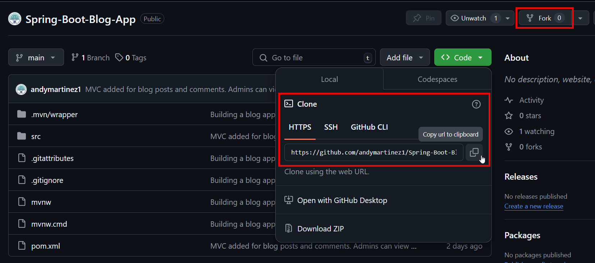
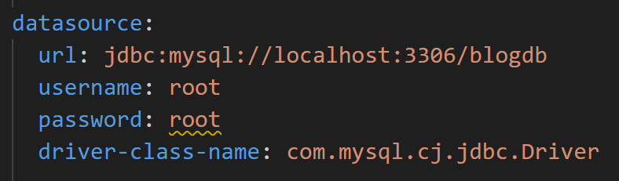
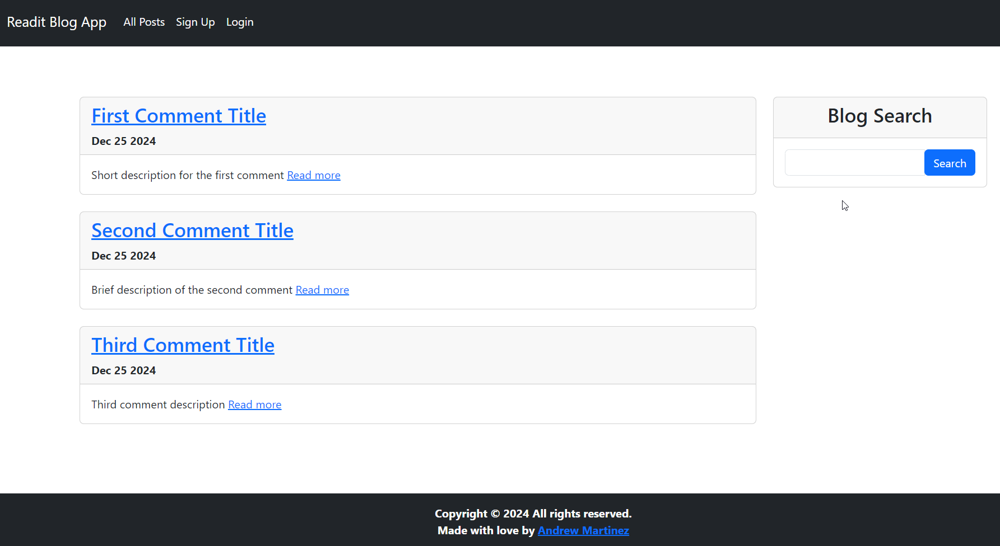
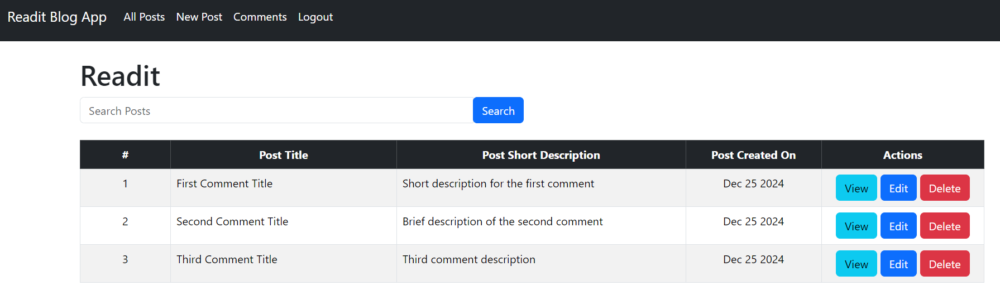

# Readit Blog App
This app allows guest users to view blog posts that registered users have submitted. They can also view and submit comments on each blog post. They have the option to register for an account or continue to use it as a guest.

Admins are allowed to view, edit or delete any post or comment by any user. 

Account registration/login uses BCrypt encoding for securely storing the password in a MySQL database. 

## How to use the app:
Fork or clone the repository:

Ensure you have a database in MySQL named blogdb on localhost:3306 (or create your own and update the application.yml file with the DB name and credentials).

Running the app for the first time will generate the necessary tables needed to use the app. However, you will need to create an admin account and user roles using the following SQL script:

    INSERT INTO `roles` VALUES (1,'ROLE_ADMIN'),(2,'ROLE_GUEST'); 
     
    INSERT INTO `users` VALUES (1,'admin@gmail.com','admin','$2a$10$k9644mshajjDvMhU8p76.u4sgOFuINZDkZ/csNgzFY99W1diZjBuC'); 
     
    INSERT INTO `users_roles` VALUES (1,1);

This allows you to sign log in using the following credentials:\
Username: admin@gmail.com\
Password: admin

You can use the following SQL script to generate 3 initial posts for testing:

    INSERT INTO posts (content, created_on, short_description, title, updated_on, url, created_by)
    VALUES 
    ('This is the content of the first comment', '2024-12-25 08:00:00', 'Short description for the first comment', 'First Comment Title', '2024-12-25 10:00:00', 'https://example.com/first-comment', '1'),
    ('Content of the second comment goes here', '2024-12-25 09:00:00', 'Brief description of the second comment', 'Second Comment Title', '2024-12-25 11:00:00', 'https://example.com/second-comment', '1'),
    ('Here is the third comment content', '2024-12-25 10:00:00', 'Third comment description', 'Third Comment Title', '2024-12-25 12:00:00', 'https://example.com/third-comment', '1');

Guest User View:

Admin View:

The blog search feature allows you to look for certain blog post titles or short descriptions by keywords. 

There will be many stylistic changes, so please stay tuned!